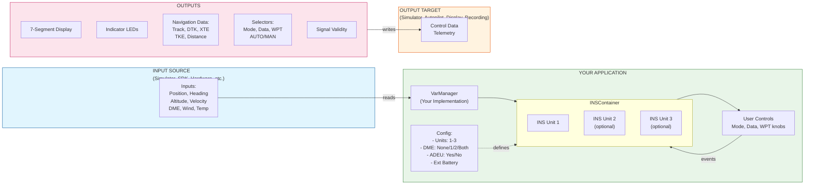

# Scope

Simulation of a Delco Electronics Carousel IV-A unit with flight program CIV-A-22.

## Implemented

- Unit temperature sim
- Instant align shortcut
- Multi Unit install up to three independent units, including triple mix.
- Unit drift, units drift along a radial. Drift radial and max 1h drift is selected on unit boot (OFF -> STBY). Radial is
  uniformly distributed, max 1h drift is normal distributed (μ = 0, σ = 1).
- Ground speed drift
- Failures
  - 02 31 - GS > 910kts
  - 02 42 - DA > 45°
  - 02 49 - Manual position update in flight > 33nmi
  - 02 63 - Position entry during align phases 5 or less
  - 04 41 - Entered position differs from last position more than 76nmi
  - 04 43 - Entered position differs between units
  - 04 57 - Taxi during alignment
- DME Update with one DME connected to units 1 and 2, with unit 3 receiving data from units 1 and 2 via unit interconnect.
  - Dual DME update using an offside DME, if both units 1 and 2 perform DME updating, the units will exchange update data via 
    unit interconnect.
- ADEU import logic (no failures)
  - ADEU, if available, is connected to all units

## Planned

## Wishes

# Build

LibCIVA uses CMake as its build tool.

```sh
mkdir .\out
cd .\out
cmake ..
msbuild .\libciva.sln # Or whatever generator is applicable for your system
```

| Option | Remark                             |
| ------ | ---------------------------------- |
| SHARED | Build shared library (default OFF) |

## For MSFS/MSFS2024

To build for the simulators, a VS2022 solution and project files are provided.

# Examples

## civaWin

Standalone CLI. Simulates a three unit install with dual DME and ADEU (SimBrief JSON provided).  
Includes a basic autopilot that can hold altitude at engagement, as well as CIVA course taken from unit 1.

### Build

```pwsh
cd .\Examples\civaWin
.\build.ps1
```

| Option | Remark                                        |
| ------ | --------------------------------------------- |
| Clean  | Cleans out dir before build (default not set) |
| Build  | Specify build type (Debug (default), Release) |

### Run

```pwsh
cd .\out\Debug
.\civaWin.exe
```

# Overview

## Block Diagram

<details>
<summary>Mermaid</summary>



</details>

<details>
<summary>ASCII</summary>

```
+---------------------------+       +----------------------------------+
|  INPUT SOURCE             |       |  YOUR APPLICATION                |
|  (Simulator, SDK,         |       |                                  |
|   Hardware, etc.)         |       |  +----------------------------+  |
|                           |       |  |      VarManager            |  |
|  +---------------------+  |       |  |  (Your Implementation)     |  |
|  |      INPUTS         |  |       |  +------------+---------------+  |
|  | Position (Lat/Lon)  |  |       |               |                  |
|  | Heading (True)      |  +------>|               | reads/writes     |
|  | Altitude            |  |       |               v                  |
|  | Ground Velocity     |  |       |  +----------------------------+  |
|  | Airspeed            |  |       |  |    INSContainer            |  |
|  | Nav DME 1/2         |  |       |  |                            |  |
|  | Wind (Dir/Speed)    |  |       |  |  [INS Unit 1]              |  |
|  | Ambient Temp        |  |       |  |  [INS Unit 2]  (optional)  |  |
|  +---------------------+  |       |  |  [INS Unit 3]  (optional)  |  |
+---------------------------+       |  |                            |  |
                                    |  |  Config:                   |  |
                                    |  |    - Units: 1, 2, or 3     |  |
                                    |  |    - DME: None/1/2/Both    |  |
                                    |  |    - ADEU: Yes/No          |  |
                                    |  |    - Extended Battery      |  |
                                    |  +-------------+--------------+  |
                                    |                |                 |
                                    |                | events          |
                                    |                v                 |
                                    |  +----------------------------+  |
                                    |  |  User Controls             |  |
                                    |  |  (Mode, Data, WPT knobs)   |  |
                                    |  +----------------------------+  |
                                    +---------------+------------------+
                                                    |
                                                    | writes
                                                    v
+--------------------------+        +------------------------------------+
|  OUTPUT TARGET           |        |           OUTPUTS                  |
|  (Simulator, Autopilot,  |        |                                    |
|   Display, Recording)    |        |  +------------------------------+  |
|                          |        |  |  7-Segment Display           |  |
|  +--------------------+  |        |  |  Indicator LEDs              |  |
|  |    Control Data    |  |<-------+  |  Mode Selector Position      |  |
|  |    Telemetry       |  |        |  |  Data Selector Position      |  |
|  +--------------------+  |        |  |  Waypoint Selector Position  |  |
+--------------------------+        |  |  AUTO/MAN Position           |  |
                                    |  |  Navigation Data:            |  |
                                    |  |    - Track (True)            |  |
                                    |  |    - Desired Track (DTK)     |  |
                                    |  |    - Cross Track Error       |  |
                                    |  |    - Track Angle Error       |  |
                                    |  |    - Distance to WPT         |  |
                                    |  |  Signal Validity             |  |
                                    |  +------------------------------+  |
                                    +------------------------------------+
```

</details>

## Initialization

```cpp
// Your VarManager implementation (extend base class)
struct MyVarManager : public libciva::VarManager {
    // Implement data I/O for your platform
};

// Create INS container with desired configuration
MyVarManager varManager;
libciva::INSContainer ins(
    varManager,                           // Your VarManager (by reference)
    libciva::UNIT_COUNT::THREE,           // 1, 2, or 3 units
    libciva::UNIT_HAS_DME::BOTH,          // NONE, ONE, TWO, BOTH
    "CIVA",                               // Config ID prefix
    true,                                 // Has ADEU
    false                                 // Extended battery
);

// Or with a pointer (like civaWin example):
// std::unique_ptr<MyVarManager> winVarManager = std::make_unique<MyVarManager>();
// libciva::INSContainer ins(*winVarManager, ...);
```

## Update Loop

```cpp
// Main update loop (called each frame)
void update(double deltaTime) {
    // 1. Read simulator data into varManager.sim
    varManager.sim.planeLatitude = readFromSim("PLANE LATITUDE");
    varManager.sim.planeLongitude = readFromSim("PLANE LONGITUDE");
    varManager.sim.planeHeadingDegreesTrue = readFromSim("PLANE HEADING DEGREES TRUE");
    varManager.sim.planeAltitude = readFromSim("PLANE ALTITUDE");
    varManager.sim.airspeedTrue = readFromSim("AIRSPEED TRUE");
    varManager.sim.navDme1 = readFromSim("NAV DME:1");
    varManager.sim.navDme2 = readFromSim("NAV DME:2");
    varManager.sim.ambientWindDirection = readFromSim("AMBIENT WIND DIRECTION");
    varManager.sim.ambientWindVelocity = readFromSim("AMBIENT WIND VELOCITY");
    varManager.sim.ambientTemperature = readFromSim("AMBIENT TEMPERATURE");
    varManager.sim.simulationRate = readFromSim("SIMULATION RATE");
    varManager.sim.velocityWorldX = readFromSim("VELOCITY WORLD X");
    varManager.sim.velocityWorldZ = readFromSim("VELOCITY WORLD Z");
    varManager.sim.accelWorldX = readFromSim("ACCELERATION WORLD X");
    varManager.sim.accelWorldZ = readFromSim("ACCELERATION WORLD Z");

    // 2. Update INS
    ins.update(deltaTime);

    // 3. Read outputs from varManager.unit[x]
    auto& unit1 = varManager.unit[0];
    double display = unit1.display;
    double indicators = unit1.indicators;
    double modeSelectorPos = unit1.modeSelectorPos;
    double dataSelectorPos = unit1.dataSelectorPos;
    double waypointSelectorPos = unit1.waypointSelectorPos;
    double autoMode = unit1.autoMode;
    double track = unit1.track;
    double desiredTrack = unit1.desiredTrack;
    double crossTrackError = unit1.crossTrackError;
    double trackAngleError = unit1.trackAngleError;
    double distance = unit1.distance;
    double gs = unit1.gs;
    double valid = unit1.valid;
}
```

## Event Handling

```cpp
// Handle user input (knobs, buttons)
void handleControlInput(Event event) {
    ins.handleEvent([event](auto unit1, auto unit2, auto unit3) {
        switch (event) {
            case Event::MODE_SELECTOR_CW:
                unit1->incModeSelectorPos();
                break;
            case Event::MODE_SELECTOR_CCW:
                unit1->decModeSelectorPos();
                break;
            case Event::DATA_SELECTOR_CW:
                unit1->incDataSelectorPos();
                break;
            case Event::DATA_SELECTOR_CCW:
                unit1->decDataSelectorPos();
                break;
            case Event::WAYPOINT_SELECTOR_CW:
                unit1->incWaypointSelectorPos();
                break;
            case Event::WAYPOINT_SELECTOR_CCW:
                unit1->decWaypointSelectorPos();
                break;
            case Event::DIGIT_0:
            case Event::DIGIT_1:
            case Event::DIGIT_2:
            case Event::DIGIT_3:
            case Event::DIGIT_4:
            case Event::DIGIT_5:
            case Event::DIGIT_6:
            case Event::DIGIT_7:
            case Event::DIGIT_8:
            case Event::DIGIT_9:
                unit1->handleNumeric(static_cast<uint8_t>(event));
                break;
            case Event::INSERT:
                unit1->handleInsert();
                break;
            case Event::CLEAR:
                unit1->handleClear();
                break;
            case Event::TEST_ON:
                unit1->handleTestButtonState(true);
                break;
            case Event::TEST_OFF:
                unit1->handleTestButtonState(false);
                break;
            case Event::DME_LL:
                unit1->handleDMEModeEntry('L');
                break;
            case Event::DME_FREQ:
                unit1->handleDMEModeEntry('F');
                break;
            case Event::WPT_CHG:
                unit1->handleWaypointChange();
                break;
            case Event::HOLD:
                unit1->handleHoldButton();
                break;
            case Event::AUTO_MAN:
                unit1->handleAutoMan();
                break;
            case Event::INSTANT_ALIGN:
                unit1->handleInstantAlign();
                break;
            case Event::REMOTE:
                unit1->handleRemote();
                break;
            case Event::EXTERNAL_POWER_ON:
                unit1->handleExternalPower(true);
                break;
            case Event::EXTERNAL_POWER_OFF:
                unit1->handleExternalPower(false);
                break;
        }
    });
}

// Bulk import DME stations (e.g., from SimBrief)
void importDME(std::array<libciva::DME, 9> dmeData) {
    ins.handleEvent([&dmeData](auto unit1, auto unit2, auto unit3) {
        unit1->remoteInsertDME(dmeData.data());
    });
}

// Bulk import waypoints (e.g., from SimBrief)
void importWaypoints(std::array<libciva::POSITION, 9> wptData) {
    ins.handleEvent([&wptData](auto unit1, auto unit2, auto unit3) {
        unit1->remoteInsertWPT(wptData.data());
    });
}
```

# API Reference

## Data Input

### INS

#### Update Functions

| Function        | Parameters      | Returns | Description                                                                                                                       |
| --------------- | --------------- | ------- | --------------------------------------------------------------------------------------------------------------------------------- |
| `updatePreMix`  | `dTime: double` | `void`  | First update phase. Handles battery, oven temp, mode changes (OFF/STBY/ALIGN), auxiliary data, ground track, out-of-bounds checks |
| `updateMix`     | none            | `void`  | Second update phase. Performs triple mix averaging between units 1, 2, 3                                                          |
| `updatePostMix` | `dTime: double` | `void`  | Third update phase. Updates navigation state, display formatting, indicators                                                      |

#### Events

| Function                 | Parameters       | Returns | Description                                                                                              |
| ------------------------ | ---------------- | ------- | -------------------------------------------------------------------------------------------------------- |
| `incDataSelectorPos`     | none             | `void`  | Rotate data selector knob clockwise (TK/GS → HDG/DA → XTK/TKE → POS → WPT → DIS/TIME → WIND → DSRTK/STS) |
| `decDataSelectorPos`     | none             | `void`  | Rotate data selector knob counter-clockwise                                                              |
| `incModeSelectorPos`     | none             | `void`  | Rotate mode selector knob clockwise (OFF → STBY → ALIGN → NAV → ATT)                                     |
| `decModeSelectorPos`     | none             | `void`  | Rotate mode selector knob counter-clockwise                                                              |
| `incWaypointSelectorPos` | none             | `void`  | Rotate waypoint selector thumb wheel forward (0→9→0)                                                     |
| `decWaypointSelectorPos` | none             | `void`  | Rotate waypoint selector thumb wheel backward                                                            |
| `handleNumeric`          | `value: uint8_t` | `void`  | Handle digit key press 0-9. Used for position/DME/waypoint entry in insert mode                          |
| `handleInsert`           | none             | `void`  | Press INSERT button. Initiates insert mode for position, DME, waypoint, or waypoint change               |
| `handleTestButtonState`  | `state: bool`    | `void`  | Press/release TEST button. Triggers self-test sequence and illuminates all segments                      |
| `handleDMEModeEntry`     | `value: uint8_t` | `void`  | Enter DME entry mode                                                                                     |
| `handleClear`            | none             | `void`  | Press CLEAR button. Cancels insert mode, clears entered data                                             |
| `handleWaypointChange`   | none             | `void`  | Press WPT CHG button. Initiates leg change (FROM/TO waypoint)                                            |
| `handleHoldButton`       | none             | `void`  | Press HOLD button. Toggles HOLD mode to freeze position display                                          |
| `handleAutoMan`          | none             | `void`  | Toggle AUTO/MAN switch. Switches between auto leg advance and manual leg advance                         |
| `handleInstantAlign`     | none             | `void`  | Instantly complete ALIGN mode (skip to NAV)                                                              |
| `handleRemote`           | none             | `void`  | Toggle REMOTE mode indicator                                                                             |
| `handleExternalPower`    | `powered: bool`  | `void`  | Signal external power state. When powered, battery charges                                               |

#### Remote Insert

| Function          | Parameters         | Returns | Description                                                                                                   |
| ----------------- | ------------------ | ------- | ------------------------------------------------------------------------------------------------------------- |
| `remoteInsertDME` | `dme: DME[9]`      | `void`  | Bulk import all 9 DME stations. Each DME contains: position (lat/lon), frequency (MHz×100), altitude (1000ft) |
| `remoteInsertWPT` | `wpt: POSITION[9]` | `void`  | Bulk import up to 9 waypoints. Updates only unused waypoints based on current leg                             |

### INSContainer

| Function      | Parameters                                                              | Returns | Description                                                        |
| ------------- | ----------------------------------------------------------------------- | ------- | ------------------------------------------------------------------ |
| `update`      | `dTime: double`                                                         | `void`  | Call updatePreMix → updateMix → updatePostMix on all units         |
| `handleEvent` | `callback: function<shared_ptr<INS>, shared_ptr<INS>, shared_ptr<INS>>` | `void`  | Invoke callback with all three unit shared_ptr for event handling. |

## Data output

Data from the units is output into variables via the variable manager.  
`x` is one of `1`, `2`, or `3`, indicating the respective unit

### LIBCIVA_DISPLAY_UNIT_x

Bit field, 64bits

| 63  | 62  | 61  | 60  | 59          | 58          | 57          | 56          | 55 - 52 | 51 - 48 | 47 - 44 | 43 - 40 | 39 - 36 | 35 - 32 | 31 - 28 | 27 - 24 | 23  | 22         | 21         | 20         | 19 - 16    | 15 - 12 | 11 - 08 | 07 - 04 | 03 - 00 |
| --- | --- | --- | --- | ----------- | ----------- | ----------- | ----------- | ------- | ------- | ------- | ------- | ------- | ------- | ------- | ------- | --- | ---------- | ---------- | ---------- | ---------- | ------- | ------- | ------- | ------- |
| W   | E   | S   | N   | Right 2nd . | Right 1st . | Right 2nd ° | Right 1st ° | TO      | FROM    | Right 6 | Right 5 | Right 4 | Right 3 | Right 2 | Right 1 |     | Left 2nd . | Left 1st . | Left 2nd ° | Left 1st ° | Left 5  | Left 4  | Left 3  | Left 2  | Left 1 |

Single bit fields are boolean and should illuminate/show respective symbol.  
4bit fields are characters. Convert using following:

```
if 0 <= x <= 9: 48 + c // ASCII symbol, shifted by 48
if x == 10: 'R' // ASCII R
if x == 11: 'L' // ASCII L
if x == 12: ' ' // blank space
```

#### Notes on the type

The primary user of this library is the MSFS and MSFS 2024 simulator platform.
These simulators can export data into local variables (LVar).
LVars are of FLOAT64 type.
As such, this variable is defined as a `union` type, with the first member being a `double`.  
This member is not to be used by C++ consumers, those shall use the second member of type `struct`, which exposes the bit field
properly.

### LIBCIVA_INDICATORS_UNIT_x

Bit field, 64bits

| 63 - 13 | 12                          | 11                          | 10             | 09               | 08            | 07         | 06            | 05          | 04           | 03           | 02         | 01              | 00            |
| ------- | --------------------------- | --------------------------- | -------------- | ---------------- | ------------- | ---------- | ------------- | ----------- | ------------ | ------------ | ---------- | --------------- | ------------- |
| Unset   | DME2 update indicator light | DME1 update indicator light | TO field blink | FROM field blink | WPT CHG light | WARN light | CDU BAT light | ALERT light | INSERT light | REMOTE light | HOLD light | READY NAV light | MSU BAT light |

#### Notes on the type

The primary user of this library is the MSFS and MSFS 2024 simulator platform.
These simulators can export data into local variables (LVar).
LVars are of FLOAT64 type.
As such, this variable is defined as a `union` type, with the first member being a `double`.  
This member is not to be used by C++ consumers, those shall use the second member of type `struct`, which exposes the bit field
properly.

### LIBCIVA__MODE_SELECTOR_POS_UNIT_x

| Value | Mode  |
| ----- | ----- |
| 0     | OFF   |
| 1     | STBY  |
| 2     | ALIGN |
| 3     | NAV   |
| 4     | ATT   |

### LIBCIVA_WAYPOINT_SELECTOR_POS_UNIT_x

Values 0 through 9, corresponding with the thumb wheel on the unit

### LIBCIVA_AUTO_MAN_POS_UNIT_x

| Value | Mode      |
| ----- | --------- |
| 0     | TK/GS     |
| 1     | HDG/DA    |
| 2     | XTK/TKE   |
| 3     | POS       |
| 4     | WAY PT    |
| 5     | DIS/TIME  |
| 6     | WIND      |
| 7     | DSRTK/STS |

### LIBCIVA_CROSS_TRACK_ERROR_UNIT_x

Calculated cross track error in nmi.  
Negative values indicate INS is left of course (right turn to get back).  
Positive values indicate INS is right of course (left turn to get back).

### LIBCIVA_DESIRED_TRACK_UNIT_x

Calculated desired track (true) in degrees.

### LIBCIVA_TRACK_UNIT_x

Calculated true track in degrees.  
Below 75kts, this will be true heading.

### LIBCIVA_TRACK_ANGLE_ERROR_UNIT_x

Calculated track angle error in degrees.  
Negative value indicates track is right of the desired track (left turn to align).  
Positive value indicates track is left of the desired track (right turn to align).

### LIBCIVA_DISTANCE_UNIT_x

Along track remaining distance (nmi) to active waypoint.

### LIBCIVA_GROUND_SPEED_UNIT_x

Calculated ground speed in knots.

### LIBCIVA_VALID_UNIT_x

| Value | Mode          |
| ----- | ------------- |
| 0     | Invalid       |
| 1     | Attitude only |
| 2     | Navigation    |
